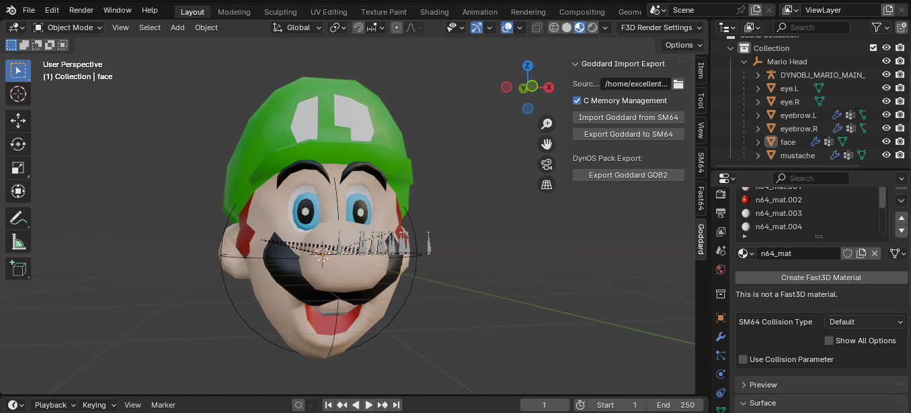
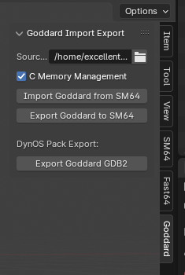
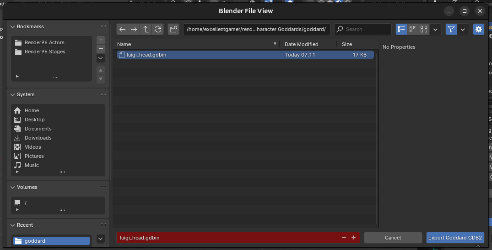

# Goddard Utility Tool for Blender

Hello! This is a plugin that will help you edit Mario's Head in the title screen of Super Mario 64.
This plugin is modified to work specifically with the Render96dx repository with a brand new "GDB2" format (.gdbin), this is a DynOS specific format that allows you to load custom Goddard heads externally in the repository.

## Installation

To get it up and running, just take the `goddard_addon` folder in this repo, and compress to a zip. Open blender 4.1.1 if you haven't already, and install it like any other addon. You're all set to use it. :)

## Usage

As you can see, you'll find the controls here in the 3D viewport. It's quite simple really.

- First you must define where the source code for the render96dx repo is. You must select its root.
- Then import the head the source already has (it takes from the source)
- Edit the imported head to your heart's content. Be sure that it still has all of its weights. They're really important.
- Once you're done, select the head root (The sphere empty) and chose which format you would like to export to, pressing "Export Goddard to SM64" exports the C files directly to the repository, pressing "Export Goddard GDB2" will open a window asking where you want to save the .gdbin file:

On the render96dx repository you can export a Goddard for each player that is in the base C player select. These include:
- mario_head.gdbin
- luigi_head.gdbin
- wario_head.gdbin
- toad_head.gdbin
- waluigi_head.gdbin

One more thing. If you plan on creating a high poly head, you should probably enable `C Memory Management` to have the compiled game run successfully.

## Limitations and Issues

This addon is pretty powerful, but it has its limits.

- No textured material; only simple colors.
- Inability to edit the skeleton that's imported. It's only there for reference (and it's kind of messed up anyways).
- Can't move the eyes. You must edit the head with the eyes in mind.
- There seems to be an issue with exporting meshes with the poly count lower than the original.
- You can't, and shouldn't delete whole meshes. A quick fix to that would probably be to either move it out of the way, or scale it _really_ small.

If you come across any issues, feel free to contact me on discord: "excellentgamer". I am not the original creator of the addon but I am willing to assist.
